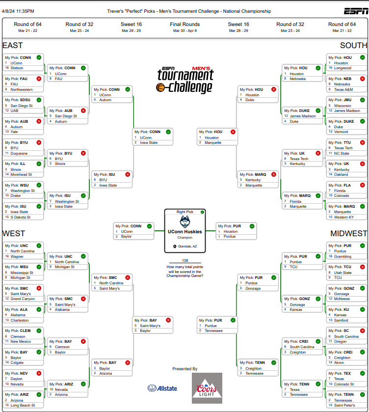
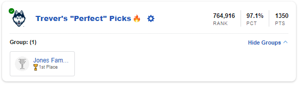

# March Madness with Machine Learning (2024)

Welcome to my March Madness 2024 repository! This repository contains all the code and data I used to train a model to assist with creation of my bracket for 2024.

## Table of Contents

- [Expectations](#my-expectations)
- [Choices Made](#my-choices)
- [The Results](#the-results)
- [Improvements For Next Year](#improvements)

## My Expectations

I started this project three days prior to the submission deadline for my family's league, so it's fair to say the process was a little rushed. I chose not to adjust the hyperparameters and omitted some data like location, coaching staff, previous upset statistics, and other datasets provided by [Kaggle](https://www.kaggle.com/competitions/march-machine-learning-mania-2024/data). My sole aspirations were to land within the top 20% of the brackets and, naturally, to secure a victory in my family league.

#### Let's look at last year's results:

It can be difficult to judge the strength of a bracket. You might think about just using the ratio of accurate predictions to total predictions. However, this proved to be an inadequate measure due to the inherent structure of brackets. If you choose a team to win the entire bracket, and they get eliminated in the first round, your ratio is significantly impacted as a single incorrect prediction could influence six subsequent predictions.

I decided to use the score assigned by ESPN, as it uses a weighted point system which will be an absolute metric, instead of a relative performance, like the percentile provides.

Here are some results from 2023:

* #### My own predictions with little knowledge of college basketball: 400 points
* #### The best bracket from my family's league: 620 points
* #### The best bracket from 2023 (according to ESPN): 1600 points

So, my target was 1000 points for 2024.

## My Choices

I decided to use Random Forest Classification for a few reasons:

* It can easily handle high dimensionality. There are too many factors that influence the outcome of a game in basketball. I could throw all the features I have at it, and the model will decide which are most useful.
* Random Forests are good at catching non-linear relationships between features, and I would assume the outcome of a basketball game is non-linear.
* Lower risk of overfitting. Random Forests create a set of decision trees from a randomly selected subset of the training set and aggregate the results to a final output which will reduce the variance of the model.

As for the data I fed into the model, I created features from each season by averaging boxscore statistics from the regular season. I then looked at each game in each tournament dating back to 2003, and created a "score" for each game which would be team1's regular season averaged stats - team2's regular season averaged stats (also including the difference of seeds), and fed in the results which would be a 1 or a 0, which represented team1 winning or not.

Like I stated above, I left the hyperparameters untouched, mainly due to time constraints.

After training the model, it scored a **70%** in accuracy on the validation set. As I understand it the general goal for models is 80%, but I accepted these results because I didn't have time to add additional features nor tune hyperparameters.

Finally, I prepared the input for the model using every single unique matchup for the 64 teams, even if a game between them was not possible in the bracket. I did this out of simplicity and wanting all the results in one place. The model made the predictions and I added the teams' names, so I could go through and create my bracket, just in the nick of time.

## The Results

It was a nail-biter, I was very nervous after the first round because my first-round accuracy did not outperform the best bracket overall nor the best in my family from last year. But I mounted an insane comeback!

### Here is my bracket:

### Result Breakdown:

I ended up with **1350 points**, and landed in the **top 3%** of all brackets for 2024 (according to ESPN). Most importantly, I secured the victory in my family league!

## Improvements

I had so much fun applying the concepts I learned in my machine learning class this semester to a real situation, and yielding such good results. I plan on doing this again next year and even entering the yearly competition hosted by Kaggle as a new challenge. With the intention of competing next year, I will have to seriously revamp this model.

#### Here are some of my ideas to improve the model:

* Of course, I need to tune the hyperparameters. This may not improve the model greatly, but it's the easiest improvement I could have implemented this year if I had the time.
* I know scikit-learn has built-in feature importance analyzers. I'd love to look at which features are most significant and see if I can create new ones that might be as significant.
* MORE FEATURES! I want to include just about everything Kaggle offers in their dataset. This should yield the best results. It may be worthwhile to include more data outside the Kaggle dataset. This could be tricky, as identifying the teams might not be as easy as Kaggle has made it, using the same teamID across the dataset. 